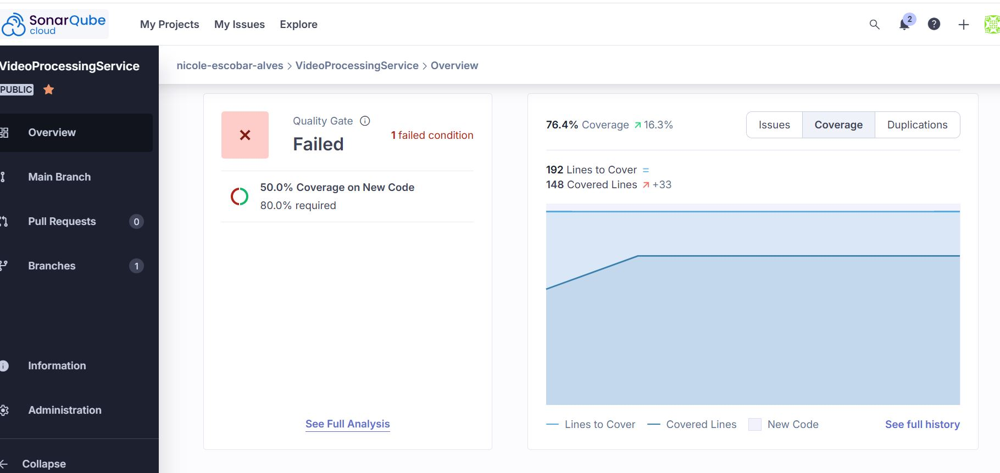

<h3 align="center">Fast Food API - Tech Challenge - 8SOAT FIAP</h3>

---

<p align="center"> Infra estrutura AWS desenvolvido por alunos do Pós Tech - FIAP. Fase 3.
    <br> 
</p>

## 📝 Índice

- [Sobre](#about)
- [Comece por aqui](#getting_started)
- [Sonar](#sonar)
- [Ferramentas](#built_using)
- [Desenvolvedores](#authors)

## 🧐 Sobre <a name = "about"></a>

Este microserviço é responsável por processar os vídeos armazenados no S3 Bucket, extrair os frames, armazenar em pasta zip e enviar o zip de volta para o S3. Após este processo, é enviado uma msg para o SQS com o url da pasta zip. 

## 🏁 Comece por aqui <a name = "getting_started"></a>

# Docker - Para rodar o projeto no docker

$ docker build -t video-processing-service .
$ docker run --rm --env-file .env video-processing-service

# Kubernets - Para rodar o projeto no kubernet

$ aws eks --region <região> update-kubeconfig --name <nome-do-cluster>

Isso vai adicionar a configuração necessária no arquivo ~/.kube/config para que você consiga interagir com o EKS usando o kubectl.

Dentro da pasta k8s/ :

$ cd k8s
$ kubectl kustomize .

# AWS - Criar um repositório e subir o projeto

# 1. Login no ECR
$ aws ecr get-login-password --region us-east-1 | docker login --username AWS --password-stdin 891377213431.dkr.ecr.us-east-1.amazonaws.com

# 2. Criar repositório (uma vez só)
$ aws ecr create-repository --repository-name video-processing-service --region us-east-1

# 3. Build da imagem
$ docker build -t video-processing-service .

# 4. Tag com o caminho completo do ECR
$ docker tag video-processing-service:latest 891377213431.dkr.ecr.us-east-1.amazonaws.com/video-processing-service:latest

# 5. Push
$ docker push 891377213431.dkr.ecr.us-east-1.amazonaws.com/video-processing-service:latest

# Para rodar o teste

Na raíz do projeto rodar

$ python -m pytest

# Gerar relatório pytest

$ pip install pytest pytest-cov

$ python -m pytest --cov=src --cov-report=xml

Teste BDD

$ python -m behave


### Terraform
Para rodar o projeto usando o terraform, é necessário seguir as etapas abaixo.

1. Instalar terraform. (Consulte: [Ferramentas](#built_using))

2. No powershell, como administrador, execute o seguinte comando para criar a estrutura:
```
$ terraform init
$ terraform validate
$ terraform plan
$ terraform apply
```
2. No powershell, como administrador, execute o seguinte comando para destruir a estrutura:
```
$ terraform destroy
```

## 🏁 Sonar <a name = "sonar"></a>

Integração com o Sonar Qube. 

[]

## ⛏️ Ferramentas <a name = "built_using"></a>

- [Terraform](https://www.terraform.io//) - Terraform.

## ✍️ Desenvolvedores <a name = "authors"></a>

- Handryo Casali
- Nicole Escobar Alves
- Luis Henrique Carreira
- Victor Hugo Silva Lima